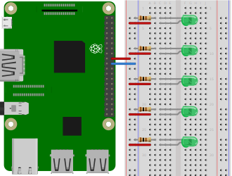

# blinking-led
This small project makes a LED blink by using nothing but a Raspberry Pi, some electrical components and 
Python.
After finishing this project, you should be able to see the LED blinking.

We assume, that you are already familiar with Python, know how to create a requirements.txt file, understand
the basics of Raspberry Pi I/O and know how to connect to the Raspberry Pi.

## Table of contents
1. [Components](#components)
2. [Design](#design)
3. [Circuit Diagram](#circuit-diagram)
4. [Dependencies](#dependencies)
5. [Code](#code)
6. [Run application](#run-application)
7. [Notes](#notes)
    1. [Parallel LED Design](#parallel-LED-design)
    2. [Parallel LED Circuit Diagram](#parallel-LED-circuit-diagram)
8. [Further reading](#further-reading)

## Components
- 1x Raspberry Pi 3
- 1x Breadboard
- 1x 100&Omega; resistor
- 1x LED (color does not really matter, we used a green one)
- 2x Female-to-male jumper wires

## Design


*Diagram created using [Fritzing](https://fritzing.org/home/)*

## Circuit Diagram
Assuming, that the Raspberry is just an AC source, and using a green LED, which has a voltage drop of 2.3V, we can 
calculate the required resistor.


The circuit can then be displayed as


*Diagram created using [EasyEDA](https://easyeda.com/)*

## Dependencies
For this project we don't need any additional dependencies.
Every package is already pre-installed on the RaspberryPi 3.

## Code
First we need to include the `gpiozero` package, which handles the communication with the Raspberry Pi.
We only want to use the `LED` object, so we import it from the `gpiozero` package.
We will also use the sleep function of the `time` package, so we will also include it there. 
```python
from gpiozero import LED
from time import sleep
```
Now we can configure the pin we're going to use.
This library uses the BCM pin numbering, therefore GPIO 24 (pin number 18) is just referenced as '24'. 
Since we use an LED (with the `LED` object), we can pass the pin number to the constructor.
```python
led = LED(24)
``` 
Blinking is just a toggling of the High (on) and Low (off) states.
The toggling can be done either with `led.on()`, followed by `led.off()`, or with the `led.toggle()` method.

We want the LED to blink three times with a speed of 1Hz (every second once).
The speed can be configured by stopping the program (putting it to sleep) for one second.
We can now configure the toggling in a while loop in combination with the sleeping.
```python
for i in range(3):
    led.toggle()    # or led.on()
    sleep(1)
    led.toggle()    # or led.off()
    sleep(1)
```

With this we have completed this quick tutorial.

As a reference, the full code can be found in the [index.py](./src/index.py) file.

## Run application
Open the console in the project's directory on your Raspberry Pi.

To run the application, type
```shell script
python src/index.py
```
in the console.
After a short time, the LED should start blinking and stop after it has blinked three times.

## Notes
Using the same code, it is also possible to make multiple LEDs blink at the same time.
For each LED that we add, we need

- 1x Male-to-male jumper wire
- 1x 100&Omega; resistor

In the example we use five parallel green LEDs.
### Parallel LED Design


*Diagram created using [Fritzing](https://fritzing.org/home/)*

### Parallel LED Circuit Diagram


*Diagram created using [EasyEDA](https://easyeda.com/)*

## Further reading
The next two projects we will look at, are similar to this one.
They involve using multiple GPIO pins to make the LEDs blink at different times.
<!--
1. [Traffic Light](../traffic-light)
2. [Binary Counter](../binary-counter)
-->